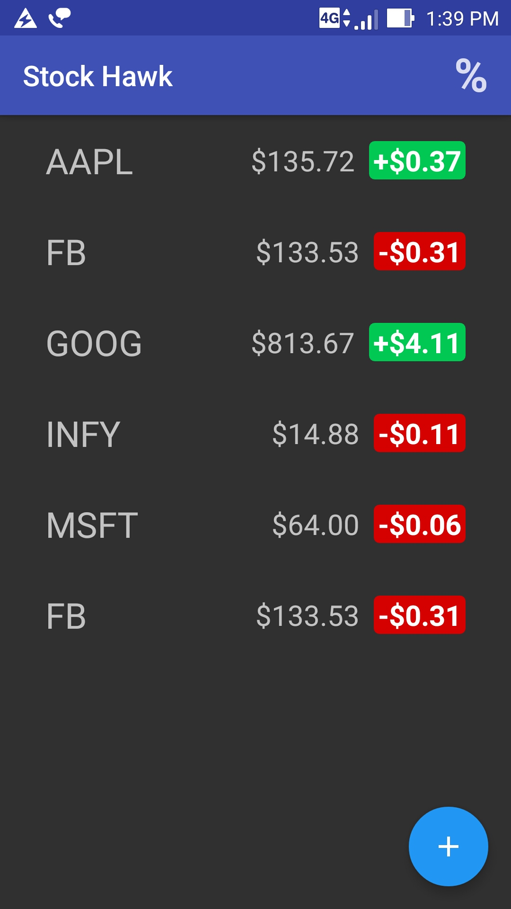
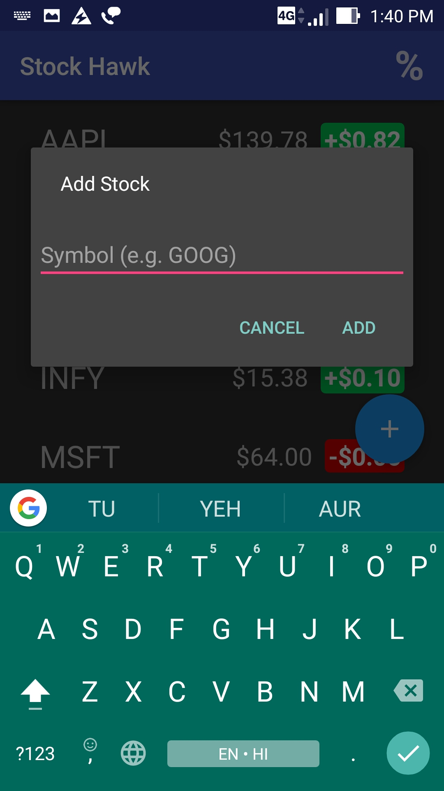
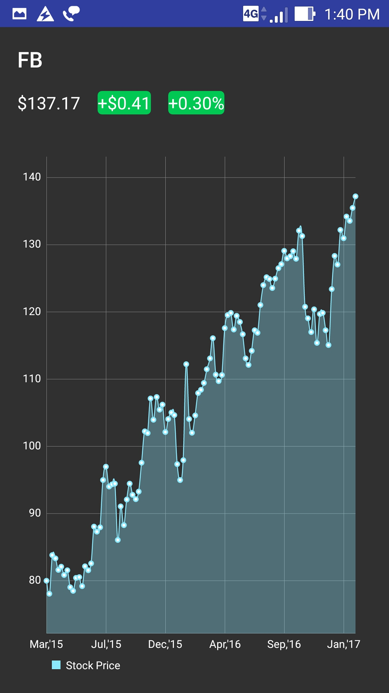

# Stock Hawk

This is the final code for Stock hawk project in Udacity's [Android Developer Nanodegree](https://www.udacity.com/course/android-developer-nanodegree-by-google--nd801). 

# Thinks I learned

- How to use third party library
- How to add a widget

# Contrubuting

Pull requests gratefully accepted.
